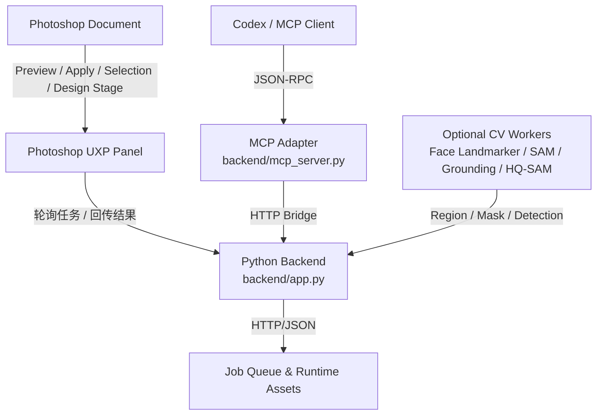

# Photoshop_bridge

中文 | [English](#english)

`Photoshop_bridge` 是一个本地优先的 Photoshop 智能代理桥接项目，用来连接 Adobe Photoshop UXP 面板、Python 后端和 MCP 适配层，让 Codex 或其他 MCP 客户端能够读取文档状态、导出预览、生成选区/蒙版、执行调色与修图任务，也能完成素材编排、版式构建、SVG 落地与阶段化设计执行。

它不是一个“一键滤镜”仓库，也不局限于“只做非破坏编辑”。更准确地说，它是一套适合智能体协作的 Photoshop 工作流基础设施：默认偏向非破坏式操作，但同时支持设计型任务、可执行设计 stage、素材放置、文本/形状构建、路径与图层编排，以及围绕 Photoshop 文档的结构化任务编排。

## 项目概览

- 本地运行 Photoshop 桥接服务，默认地址 `127.0.0.1:17860`
- 在 Photoshop 内加载 UXP 面板，负责轮询任务和回传结果
- 通过 MCP Server 对外暴露工具，供 Codex 或其他 MCP 客户端调用
- 支持非破坏编辑计划、图层配方、工作流 stage、operation atoms
- 支持设计类执行流程：素材扫描、版式规划、可执行 design stage、SVG 对象编译
- 支持可选本地视觉能力：Face Landmarker、SAM、Grounding DINO、HQ-SAM
- 支持从“区域识别”到“选区/alpha/path”再到“最终 Photoshop 操作”的完整链路

## 核心能力

- 文档读取：状态查询、健康检查、诊断、整图预览、局部导出
- 选区工作流：主体、天空、色彩范围、alpha mask、多边形、复合选区
- 图像调色：曝光、自然饱和度、色彩平衡、色相/饱和度、曲线、色阶、可选颜色、渐变映射、LUT、Camera Raw Filter
- 修图辅助：点修复、内容识别填充、蒙版准备
- 设计流程：素材库扫描、设计计划创建、stage review、设计包导出
- 设计执行：素材放置、图层变换、文字创建、形状生成、路径转选区、路径描边/填充
- 向量/设计工具：SVG 编译、Bezier/路径审计
- MCP 集成：通过工具注册表把 Photoshop 能力暴露给外部智能体

## 功能流程图



## 工作流程

1. 启动 Python 后端，暴露本地 HTTP 接口。
2. 在 Photoshop 中加载 `PS UXP Agent` 面板。
3. UXP 面板向后端轮询任务并执行文档操作。
4. MCP 客户端通过 `backend/mcp_server.py` 调用已注册工具。
5. 后端按需调用选区、调色、修图、设计或视觉模型能力。
6. 结果通过任务队列回传给 UXP 面板，并返回给调用方。

## 设计任务能力说明

这个系统不只是“做局部修图”或者“做非破坏调色”。它还具备明确的设计任务路线，适合海报、封面、拼贴、商业图文、布局实验等场景。

设计路线的关键点包括：

- 可以扫描本地素材库，生成 contact sheet 和分析结果，作为设计输入
- 可以创建 design plan，把设计意图写成可审阅、可验证、可分 stage 执行的结构
- 可以把设计 stage lower 成共享的 `operation_recipe` 或 `selection_recipe`
- 可以执行素材放置、缩放、重排、剪贴蒙版、文本创建、几何图形创建、路径描边/填充
- 可以用 SVG 编译链路把结构化向量对象转成 Photoshop 可落地的资产和步骤

换句话说，`Photoshop_bridge` 既覆盖“编辑型任务”，也覆盖“设计型任务”；只是对编辑型任务默认强调非破坏优先，对设计型任务强调 stage 化执行和可回看性。

## 选区与区域生成路径

这个项目的选区体系不是单一路径，而是“多种区域来源 + 多种 Photoshop 落地形式”的组合。区域来源可以是 Face Landmarker、SAM/HQ-SAM、Grounding DINO、颜色范围、多边形、bbox，最终则可以落成：

- `alpha_mask`：适合高保真软蒙版
- `polygon selection`：适合蚂蚁线和硬边选区
- `bezier/path`：适合钢笔路径、描边、填充或后续设计用途
- `selection_recipe`：适合把多个候选选择方法组合成一条可执行选区流程

这意味着模型本身并不是终点。模型输出首先是“区域”，而不是直接等同于最终 Photoshop 操作。后端还提供了 region artifact 的统一抽象，可以把区域继续 lower 成选区或路径。

### Face Landmarker 路径

`Face Landmarker` 这条路径主要用于“人脸局部精细区域”，例如眼睛、嘴唇、脸型轮廓、左右脸颊等。它不是通用语义分割，而是面向人脸结构的几何定位路径。

适合的目标：

- `left_eye`
- `right_eye`
- `both_eyes`
- `lips_outer`
- `face_oval`
- `left_cheek`
- `right_cheek`

这条路径的典型工作方式是：

1. 先提供一个人脸相关 crop 或局部图像。
2. `ps_generate_face_selection` 基于本地 `face_landmarker.task` 推断人脸关键点。
3. 后端把关键点组织成 polygon 轮廓，而不是直接生成通用语义 alpha。
4. 调用方可以进一步平滑、扩张、羽化这些轮廓。
5. 最终可以把结果作为局部选区使用，适合眼睛提亮、唇部微调、脸颊色彩修饰、脸型范围保护等任务。

这条路径的优点：

- 对人脸局部语义非常明确，不需要额外文本 prompt
- 结果更适合五官或面部区域的定点处理
- 比通用语义检测更稳定地表达“左眼”“嘴唇外轮廓”“脸颊”等细分结构

这条路径的限制：

- 它不是通用物体选区工具，适用范围基本集中在人脸结构
- 输出更偏 polygon/几何轮廓，而不是高质量软边 alpha mask
- 对遮挡严重、侧脸极端、分辨率很低的人脸，结果会受影响

因此，`Face Landmarker` 更像“面部局部结构选区器”，非常适合精细修图和面部局部保护，但不适合作为通用主体分割方案。

### Grounding DINO + HQ-SAM 路径

`Grounding DINO + HQ-SAM` 是这个项目里更偏“语义物体区域生成”的路线。它适合的不是五官，而是有明确语义名称的对象，例如：建筑、招牌、衣服、黑板、产品、花、背景道具、某个前景物体等。

这条路径的核心思路是“两阶段”：

1. `Grounding DINO` 根据文本 prompt 找目标物体，并给出候选检测框。
2. `HQ-SAM` 再根据检测框做高质量分割，产出更适合 Photoshop 使用的 alpha mask。

在项目里的典型工具组合包括：

- `ps_detect_grounding_boxes`：先看检测是否找对对象
- `ps_generate_hqsam_mask`：当你已经有可靠 bbox/点提示时，直接做 HQ-SAM 分割
- `ps_generate_grounded_hq_mask`：把文本检测和 HQ-SAM 分割串成一条完整语义选区路径

这条路径特别适合：

- 目标是“有名字的物体”，而不是简单亮区、色区或人脸部位
- 用户能用自然语言描述对象，例如“the blackboard”“front building”“red jacket”“flower bouquet”
- 需要一个软边、可作为图层蒙版使用的高质量 `alpha_mask`
- 需要 include / exclude prompt 去提升语义选择稳定性

它的标准链路通常是：

1. 对局部或整图发起文本检测请求。
2. 用 include prompt 指定想要的对象，用 exclude prompt 排除容易混淆的对象。
3. `Grounding DINO` 返回候选框、分数、去重后的检测结果。
4. 选择合适框后，由 `HQ-SAM` 生成分割结果。
5. 后端返回 `alpha_mask`、检测结果和 overlay 预览。
6. 如果需要硬选区或路径，再通过 region artifact lower 成 `selection_recipe` 或 `path`。

这条路径的优点：

- 对“语义对象”非常强，尤其适合普通 Photoshop 原生命令难以稳定选中的物体
- 生成的是软边 mask，适合局部调色、背景替换、物体保护、设计拼贴
- 能通过 include / exclude prompt 细化目标，减少误选
- 与 region artifact 体系兼容，后续可以继续 lower 成其他 Photoshop 表达

这条路径的限制：

- 成功率依赖 prompt、检测框质量、目标可见度和模型状态
- `Grounding DINO` 的 CUDA 扩展未就绪时，可能回退到 CPU，速度会变慢
- 如果目标极小、遮挡严重，或者文本语义描述模糊，检测框可能不稳定
- 它更适合“物体级语义区域”，不如 Face Landmarker 擅长面部局部精细结构

因此可以这样理解：

- 面部五官和脸部局部，优先 `Face Landmarker`
- 已知 bbox/点提示的复杂非人脸区域，优先 `SAM / HQ-SAM`
- 需要“按语义描述找到某个物体”时，优先 `Grounding DINO + HQ-SAM`
- 当模型输出一个好区域后，再根据任务决定它最终是 `alpha_mask`、`polygon selection` 还是 `path`

### 区域落地形式

无论区域来自 Face Landmarker、SAM、HQ-SAM 还是 Grounding DINO，这个系统都强调“先得到可复用区域，再决定 Photoshop 中如何表达它”。常见落地方式有：

- 用 `alpha_mask` 作为图层蒙版，适合软边局部调色或保护
- 用 `ps_lower_region_to_selection_recipe` 转成 polygon/hard selection，适合蚂蚁线验证或原生命令衔接
- 用 `ps_lower_region_to_path` 转成路径，适合钢笔、描边、填充或设计任务

这也是为什么项目不仅是修图桥，也是一套更通用的“Photoshop 区域操作基础设施”。

## 仓库结构

```text
backend/                         Python 后端、CLI、workers、schemas、tests
UXP_plugin/com.yfy25.psuxpagent/ Photoshop UXP 插件
mcp/                             MCP 客户端配置示例
docs/                            中文工具与工作流文档
design_assets/                   本地设计素材目录
ps_skill/                        Codex 技能说明
```

## 环境要求

- Windows
- Adobe Photoshop `26.10+`
- Python `3.11+`，推荐使用虚拟环境
- UXP Developer Tool，用于开发期加载插件
- 后端虚拟环境 `.venv`

可选组件：

- MediaPipe Face Landmarker 模型
- `.venv-sam` 中的 SAM 2.1 环境
- `.venv-sam` 中的 Grounding DINO + HQ-SAM 环境

## 快速开始

### 1. 克隆并创建环境

```powershell
git clone <your-repo-url>
cd Photo_sontrol
python -m venv .venv
.\.venv\Scripts\python.exe -m pip install -r backend\requirements-ml.txt
```

如果你需要 SAM / Grounding / HQ-SAM，额外创建一个独立环境：

```powershell
python -m venv .venv-sam
```

### 2. 启动后端

```powershell
.\.venv\Scripts\python.exe backend\cli.py daemon start
.\.venv\Scripts\python.exe backend\cli.py daemon status
```

默认监听地址：`http://127.0.0.1:17860`

### 3. 加载 Photoshop 插件

在 UXP Developer Tool 中添加：

`UXP_plugin/com.yfy25.psuxpagent/manifest.json`

然后在 Photoshop 中加载插件，面板名称为 `PS UXP Agent`。

### 4. 验证桥接状态

```powershell
.\.venv\Scripts\python.exe backend\cli.py doctor
.\.venv\Scripts\python.exe backend\cli.py health
```

## 可选本地模型

详见 [backend/models/README.md](backend/models/README.md)。

默认模型路径：

- `backend/models/face_landmarker.task`
- `backend/models/sam2/sam2.1_hiera_base_plus.pt`
- `backend/models/grounding_dino/groundingdino_swint_ogc.pth`
- `backend/models/grounding_dino/GroundingDINO_SwinT_OGC.py`
- `backend/models/sam_hq/sam_hq_vit_l.pth`

启动可选 worker：

```powershell
.\.venv\Scripts\python.exe backend\cli.py sam start
.\.venv\Scripts\python.exe backend\cli.py grounding start
```

## MCP 集成

示例配置：

- [mcp/mcp-client.example.json](mcp/mcp-client.example.json)
- [mcp/codex.example.toml](mcp/codex.example.toml)

最小配置示例：

```json
{
  "mcpServers": {
    "ps-uxp-agent": {
      "command": "python",
      "args": ["D:\\Photo_sontrol\\backend\\mcp_server.py"],
      "env": {
        "PS_AGENT_BACKEND_URL": "http://127.0.0.1:17860"
      }
    }
  }
}
```

## 常用命令

```powershell
.\.venv\Scripts\python.exe backend\cli.py daemon start
.\.venv\Scripts\python.exe backend\cli.py daemon stop
.\.venv\Scripts\python.exe backend\cli.py daemon logs
.\.venv\Scripts\python.exe backend\cli.py doctor
.\.venv\Scripts\python.exe backend\cli.py preview
.\.venv\Scripts\python.exe backend\cli.py state
```

## FAQ

### 1. 这个项目会直接修改 Photoshop 原图吗？

它默认偏向非破坏式路径，例如调整图层、蒙版、smart filter、结构化 plan 和 stage 化执行。但这不代表它只能做非破坏编辑；在设计任务和部分执行路径里，它也可以完成真实的文档构建、素材放置和布局操作。

### 2. 没有安装 SAM 或 Grounding 模型还能用吗？

可以。核心桥接、预览导出、普通选区和大部分调色能力仍然可用。缺少可选模型时，相关工具会返回结构化诊断，而不是静默失败。

### 3. 这个项目只能给 Codex 用吗？

不是。它本质上是一个本地 Photoshop bridge，加上一层 MCP 适配，所以任何兼容 MCP 的客户端都可以接入。

### 4. 为什么要把后端和视觉模型 worker 分开？

这是为了稳定性和隔离性。主后端保持更轻量，SAM / Grounding / HQ-SAM 依赖单独放在 `.venv-sam`，可以减少桥接主流程被重依赖拖垮的风险。

### 5. 这个仓库已经适合直接开源发布了吗？

基本可以作为技术展示或开发型仓库发布。当前仓库已经补充根目录 MIT License；如果公开前还想更完整一些，建议再补仓库截图、安装依赖说明，以及一两个典型工作流示例。

### 6. 项目名称为什么写成 `Photoshop_bridge`？

README 已按你的要求使用 `Photoshop_bridge` 作为对外展示名。如果你还希望仓库目录名、插件显示名、MCP server 名称也一起统一，我可以继续帮你整理一版重命名清单。

## 测试

当前仓库包含 SVG 几何相关测试：

```powershell
.\.venv\Scripts\python.exe -m unittest backend.tests.test_svg_geometry
```

## 参考文档

- [docs/tool_registry_zh.md](docs/tool_registry_zh.md)
- [docs/design_workflow_zh.md](docs/design_workflow_zh.md)
- [docs/design_overlay_v2_zh.md](docs/design_overlay_v2_zh.md)
- [docs/advanced_ps_atoms_zh.md](docs/advanced_ps_atoms_zh.md)
- [docs/region_artifacts_zh.md](docs/region_artifacts_zh.md)
- [ps_skill/SKILL.md](ps_skill/SKILL.md)

## License

本仓库根目录已采用 [MIT License](LICENSE) 开源。

另外，`UXP_plugin/com.yfy25.psuxpagent/` 目录中保留了 Adobe UXP starter template 自带的 Apache-2.0 许可证文件，用于说明该模板来源与对应第三方许可信息。

---

## English

`Photoshop_bridge` is a local-first Photoshop agent bridge that connects an Adobe Photoshop UXP panel, a Python backend, and an MCP adapter so Codex or other MCP clients can inspect document state, export previews, generate masks or selections, run grading and retouching tasks, and also execute design-oriented workflows such as asset placement, layout construction, and staged design operations.

It is not limited to non-destructive editing. A more accurate description is: non-destructive first where possible, but broad enough to cover executable design workflows, structured layer operations, asset composition, path-based actions, and Photoshop-oriented task orchestration.

## Overview

- Runs a local Photoshop bridge on `127.0.0.1:17860`
- Loads a UXP panel inside Photoshop to poll jobs and return results
- Exposes Photoshop tools through an MCP server for Codex or other MCP clients
- Supports non-destructive edit plans, layer recipes, workflow stages, and operation atoms
- Supports executable design workflows, asset placement, and SVG-backed design stages
- Supports optional local CV workers: Face Landmarker, SAM, Grounding DINO, and HQ-SAM

## Selection Paths

Two important region-generation routes in this project are:

- `Face Landmarker`: best for facial subregions such as eyes, lips, cheeks, and face oval; produces geometry-oriented face-part selections
- `Grounding DINO + HQ-SAM`: best for named semantic objects such as products, signs, buildings, clothes, props, and other non-face targets; combines text-guided detection with high-quality mask generation

The key design idea is that model output is treated as a reusable region source first, then lowered into the most appropriate Photoshop form: `alpha_mask`, polygon selection, or path.

## Setup

### 1. Create the backend environment

```powershell
python -m venv .venv
.\.venv\Scripts\python.exe -m pip install -r backend\requirements-ml.txt
```

### 2. Start the backend

```powershell
.\.venv\Scripts\python.exe backend\cli.py daemon start
```

### 3. Load the UXP plugin

Add `UXP_plugin/com.yfy25.psuxpagent/manifest.json` in UXP Developer Tool and load the panel into Photoshop.

### 4. Validate the bridge

```powershell
.\.venv\Scripts\python.exe backend\cli.py doctor
```

## FAQ

### Is this project limited to non-destructive editing?

No. Non-destructive editing is the preferred default for many edit flows, but the system also supports executable design tasks, document-building operations, asset placement, and stage-based layout workflows.

### Is this project usable without the optional ML models?

Yes. Core bridge features, preview export, many selection flows, and most grading tools still work. Optional model-backed tools return structured diagnostics when prerequisites are missing.

### Is it limited to Codex?

No. Codex is one intended client, but the MCP adapter makes it usable from other MCP-compatible clients as well.

### Why separate the main backend and the vision workers?

To improve stability and isolate heavier ML dependencies. The main bridge stays lighter, while SAM / Grounding / HQ-SAM can evolve independently in `.venv-sam`.

### Is `Photoshop_bridge` the official repository name now?

The README now uses `Photoshop_bridge` as the public-facing project name. If you want, the next step can be a repo-wide rename pass for package metadata, plugin labels, docs, and MCP naming.

## License

This repository is now released under the [MIT License](LICENSE).

The `UXP_plugin/com.yfy25.psuxpagent/` directory still contains the Adobe UXP starter template Apache-2.0 license file to preserve upstream template licensing context.
